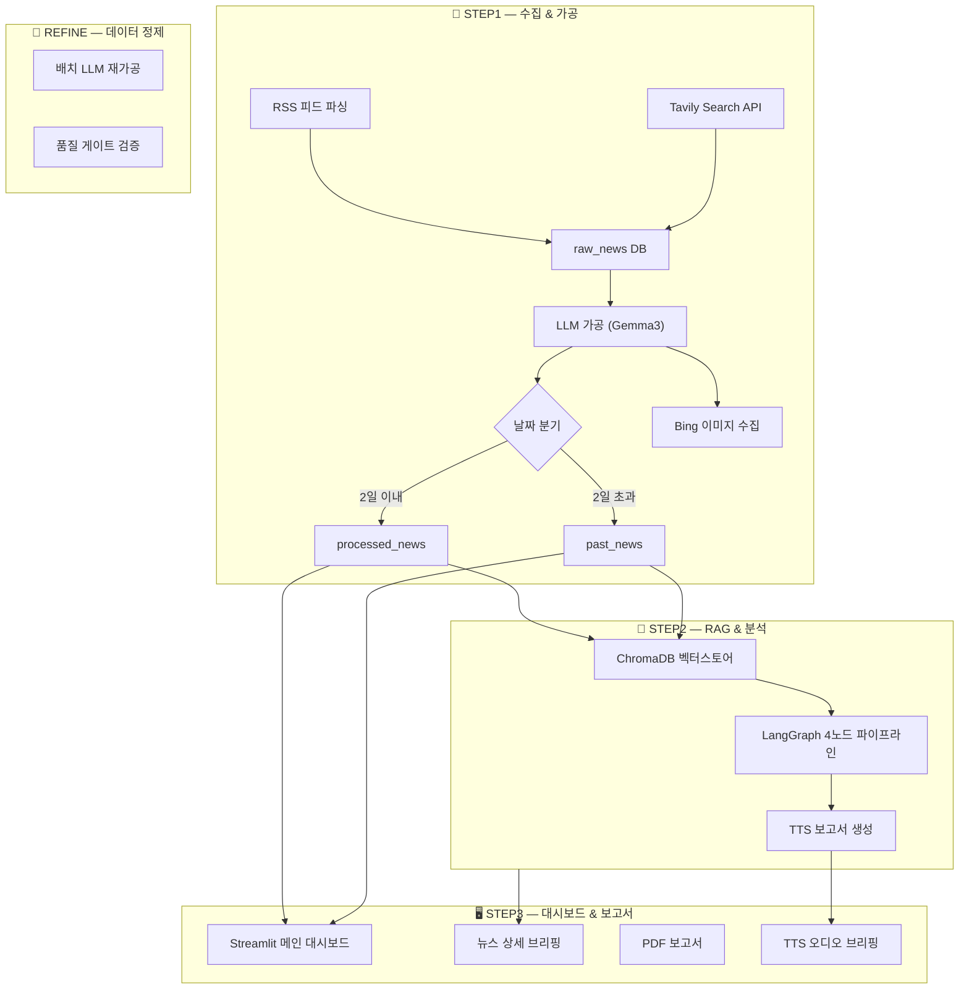
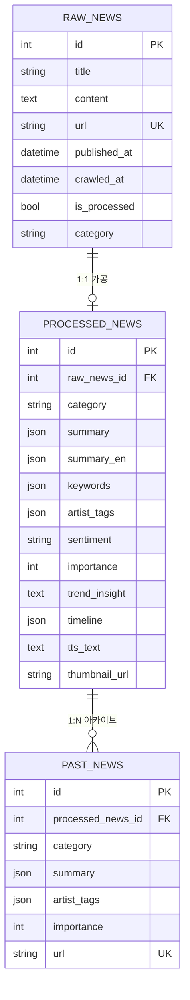

<p align="center">
  
</p>

## 「덜읽더알」 K-ENT 뉴스브리핑 서비스 기획안

---

## 목차

1. 프로젝트 개요
2. 시스템 아키텍처
3. 팀 역할 분담
4. 산출물
5. 핵심 기능
6. 전체 데이터 흐름
7. 파일트리 전수 분석
8. 프로젝트 실행 방법
9. 향후 계획 및 한계
10. 트러블슈팅 및 이슈 해결

---

## 1. 프로젝트 개요

### 1.1 서비스명

**덜읽더알** — "덜 읽고, 더 알 수 있는" AI 뉴스 브리핑 서비스

### 1.2 개발 배경

K-엔터테인먼트 산업은 매일 수백 건의 뉴스가 쏟아지는 정보 과잉의 시대에 놓여 있습니다.
기획사 담당자, 마케터, 투자자 등 업계 종사자들은 한정된 시간 안에 방대한 뉴스를 소화해야 하지만,
핵심 이슈를 놓치거나 트렌드 변화를 감지하지 못하는 문제가 반복되고 있습니다.

이에 AI 기반 자동 뉴스 큐레이션 시스템을 구축하여, 정보 탐색에 소요되는 비용을 획기적으로 줄이고
데이터에 기반한 의사결정을 지원하고자 본 프로젝트를 기획하였습니다.

### 1.3 프로젝트 목표

| 목표         | 설명                                                         |
| ------------ | ------------------------------------------------------------ |
| **자동화**   | 뉴스 수집부터 분석, 보고서, 음성 브리핑까지 전 과정 자동화   |
| **정확성**   | AI 가공 + Pydantic 스키마 검증으로 구조화된 데이터 품질 보장 |
| **인사이트** | 단순 요약을 넘어 과거 뉴스와 연결한 트렌드 인사이트 제공     |
| **접근성**   | 대시보드(웹), PDF(문서), TTS(음성) 3가지 채널로 콘텐츠 전달  |

### 1.4 타겟 사용자

- 엔터테인먼트 기획사 전략·마케팅 담당자
- K-엔터 관련 투자자 및 애널리스트
- 미디어·콘텐츠 업계 종사자
- K-POP 산업 연구자

---

## 2. 시스템 아키텍처

### 2.1 전체 파이프라인 흐름

본 시스템은 3단계 파이프라인 + 품질 개선 모듈로 구성됩니다.



| 단계       | 주요 처리                                           | 산출물                                    |
| ---------- | --------------------------------------------------- | ----------------------------------------- |
| **STEP 1** | RSS/Tavily 크롤링 → 필터링 → LLM 가공 → 이미지 수집 | `raw_news`, `processed_news`, `past_news` |
| **STEP 2** | 벡터 임베딩 → RAG 인사이트 → 타임라인 → TTS 생성    | `trend_insight`, `timeline`, TTS 오디오   |
| **STEP 3** | Streamlit 대시보드 → PDF 보고서 → 음성 브리핑       | 웹 대시보드, PDF, MP3                     |
| **REFINE** | 기존 가공 데이터 LLM 재가공 + 품질 게이트           | 개선된 `processed_news`                   |

### 2.2 기술 스택

| 영역             | 기술                                                        |
| ---------------- | ----------------------------------------------------------- |
| **데이터 수집**  | Tavily API, RSS (feedparser), Playwright (이미지)           |
| **AI / LLM**     | Ollama (Gemma3), OpenAI SDK (로컬 엔드포인트)               |
| **임베딩 / RAG** | ChromaDB, HuggingFace Embeddings (snowflake-arctic-embed-m) |
| **워크플로우**   | LangGraph (StateGraph 기반 4노드 파이프라인)                |
| **데이터베이스** | SQLite + SQLAlchemy ORM                                     |
| **스키마 검증**  | Pydantic v2 (자동 보정 로직 포함)                           |
| **프론트엔드**   | Streamlit, Plotly                                           |
| **보고서**       | ReportLab (PDF), Matplotlib (차트)                          |
| **음성 합성**    | Edge-TTS (한국어)                                           |
| **외부 API**     | 네이버 뉴스 검색 API (타임라인용)                           |

### 2.3 데이터 수집 범위

**17개 카테고리**, **50개 이상 언론사**에서 뉴스를 수집합니다.

```
📂 컨텐츠 & 작품 (7개)
 ├─ 음악/차트 · 앨범/신곡 · 콘서트/투어
 ├─ 드라마/방송 · 예능/방송
 └─ 공연/전시 · 영화/OTT

📂 인물 & 아티스트 (6개)
 ├─ 팬덤/SNS · 스캔들/논란 · 인사/동정
 └─ 미담/기부 · 연애/결혼 · 입대/군복무

📂 비즈니스 & 행사 (4개)
 ├─ 산업/기획사 · 해외반응
 └─ 마케팅/브랜드 · 행사/이벤트 · 기타
```

**수집 대상 언론사 (주요):**
연합뉴스, 디스패치, 스타뉴스, OSEN, 마이데일리, 뉴스엔, 엑스포츠뉴스, 조선일보, 동아일보, 한겨레, 한국경제, 매일경제, SBS, MBC, KBS, JTBC, Soompi, AllKpop 등

**필터링 규칙:**

- 블로그/카페/개인 포스트 자동 차단 (15+ 도메인 블랙리스트)
- 본문 200자 미만 기사 제외
- 한국 연예계 비관련 기사 자동 필터링
- 중국(.cn), 일본(.jp) 도메인 차단

### 2.4 데이터 모델

시스템은 3개의 핵심 테이블로 구성됩니다.



| 테이블             | 역할                     | 주요 컬럼                                                                                                      |
| ------------------ | ------------------------ | -------------------------------------------------------------------------------------------------------------- |
| **raw_news**       | 크롤링 원본 저장         | title, content, url, published_at, category                                                                    |
| **processed_news** | AI 가공 결과 (최신 뉴스) | summary(KO/EN), keywords, artist_tags, sentiment, importance, trend_insight, timeline, tts_text, thumbnail_url |
| **past_news**      | 과거 뉴스 아카이브       | processed_news와 동일 구조 (RAG 검색용)                                                                        |

**AI 가공 시 생성되는 15+ 필드:**

| 필드                        | 설명                                          |
| --------------------------- | --------------------------------------------- |
| `summary`                   | 한국어 요약 카드 4~6장 (label + content 구조) |
| `summary_en`                | 영어 요약 카드 (한국어와 1:1 대응)            |
| `keywords`                  | 핵심 키워드 5개                               |
| `artist_tags`               | 관련 아티스트/인물 태그                       |
| `category` / `sub_category` | 대분류 / 중분류 자동 분류                     |
| `sentiment`                 | 감성 분석 (긍정/부정/중립)                    |
| `importance`                | 중요도 점수 (1~10)                            |
| `importance_reason`         | 중요도 채점 근거                              |
| `trend_insight`             | RAG 기반 트렌드 한줄평                        |
| `timeline`                  | 아티스트 최근 6개월 타임라인                  |
| `tts_text`                  | 음성 브리핑용 텍스트 (220자 이하)             |
| `ko_title`                  | 한국어 제목                                   |
| `source_name`               | 출처 언론사                                   |
| `thumbnail_url`             | 자동 수집된 대표 이미지 URL                   |

---

## 3. 팀 역할 분담

| 역할                       | 담당자                 | 상세 업무                                 |
| -------------------------- | ---------------------- | ----------------------------------------- |
| **👑 조장**                | **용남**               | 프로젝트 총괄 관리 및 리딩                |
| **💡 기획**                | 용남, 혜원, 채은       | 서비스 기획, 프로세스 설계, 요구사항 정의 |
| **⚙️ 백엔드 STEP 1**       | 용남, 혜원, 승우       | 뉴스 크롤링 엔진, 1차 AI 가공 파이프라인  |
| **🧠 백엔드 STEP 2**       | 유진                   | RAG 인사이트, 타임라인, TTS 연동          |
| **🖥️ 백엔드 STEP 3**       | 왕이, 혜원             | 데이터 로딩, 대시보드 백엔드              |
| **✍️ 프롬프트 엔지니어링** | 채은, 해량, 지선       | LLM 요약/인사이트 프롬프트 설계 및 최적화 |
| **🎨 UI/UX**               | 왕이, 혜원             | Streamlit 대시보드 화면 설계 및 스타일링  |
| **📊 리포트 (PDF)**        | 유진, 채은, 해량, 왕이 | PDF 보고서 레이아웃, 차트, 분석 섹션      |
| **🧩 코드 통합**           | 혜원                   | 전체 모듈 결합, 충돌 해결, 통합 검증      |
| **🎬 영상/편집**           | 용남, 승우             | 시연 영상 촬영 및 편집                    |
| **📂 PPT**                 | 지선                   | 발표 자료 제작                            |

---

## 4. 산출물

### 4.1 대시보드 (Streamlit 웹앱)

| 화면                 | 구성 요소                                                         |
| -------------------- | ----------------------------------------------------------------- |
| **메인 화면**        | 메트릭 카드 4종 (뉴스 수, 긍정 비율, 부정 급등, 핫 키워드)        |
| **랭킹**             | 1위 Featured 대형 카드 + 2~10위 그리드 카드 (썸네일, 감성 배지)   |
| **상세 페이지 (좌)** | 뉴스 본문, 요약 카드 (한국어/영어), 키워드 태그                   |
| **상세 페이지 (우)** | 트렌드 인사이트 위젯, 6개월 타임라인, 관련 키워드 기사 (유사도 %) |
| **부가 기능**        | 📄 PDF 다운로드 버튼, 🎙️ TTS 브리핑 재생 버튼                     |

### 4.2 PDF 보고서

| 섹션                  | 내용                                                           |
| --------------------- | -------------------------------------------------------------- |
| **Top 10 뉴스 요약**  | 순위별 제목 + TTS 텍스트 (1~3위 빨간 배지, 4~10위 파란 배지)   |
| **종합 인사이트**     | LLM이 생성한 Top 10 트렌드 종합 요약 (3~4문장)                 |
| **감성 분포도**       | 긍정/부정/중립 비율 카드 + 키워드 분석 + 주간 비교 도넛 차트   |
| **카테고리 분석**     | 전체 뉴스 카테고리별 분포 막대그래프 + 소분류별 대표 기사 트리 |
| **핵심 키워드 TOP 3** | 전체 뉴스에서 가장 많이 등장한 키워드 집계                     |

### 4.3 TTS 오디오 브리핑

- 형식: MP3 (`news_report_ko.mp3`)
- 음성: 한국어 여성 (ko-KR-SunHiNeural)
- 속도: 1.5배속
- 내용: Top 10 뉴스 제목 + 한줄평 요약

### 4.4 데이터베이스

- `k_enter_news.db` (SQLite) — 전체 뉴스 데이터
- `chroma_db/` — 벡터 임베딩 데이터 (최신 뉴스 / 과거 뉴스 2개 컬렉션)

---

## 5. 핵심 기능

### 3.1 뉴스 자동 수집 (STEP 1)

**[입력]** 17개 카테고리별 검색 쿼리 + RSS 피드 URL

**[처리]**

1. **Tavily API**: 카테고리당 최대 100건 웹 검색 (K-엔터 전문 쿼리)
2. **RSS 피드**: Soompi, AllKpop, 연합뉴스 등 주요 매체 피드 파싱
3. **이중 필터링**: 블로그 차단 + 본문 최소 200자 + 한국 연예계 연관성 검사
4. **인물 힌트 추출**: 제목·본문에서 한국어/영문 인물명 패턴 자동 추출

**[출력]** `raw_news` 테이블에 정제된 원본 기사 저장

### 3.2 AI 뉴스 가공 (STEP 1)

**[입력]** raw_news 원본 기사

**[처리]**

1. **Gemma3 LLM** 호출 → 15+ 필드의 구조화된 JSON 생성
2. **Pydantic 스키마 검증** → 카테고리 자동 보정, 감성값 정규화, 중요도 범위 체크
3. **불량 데이터 자동 필터** → 포털 메인 페이지, 네비게이션 데이터 등 차단
4. **날짜 기반 분기** → 최근 2일: `processed_news` / 과거: `past_news`
5. **Bing 이미지 자동 수집** → 아티스트별 중복 없는 썸네일 확보

**[출력]** 구조화된 뉴스 데이터 + 대표 이미지

### 3.3 Top 10 뉴스 선정 알고리즘 (STEP 2)

매일의 수백 건 뉴스 중 **가장 중요한 10건**을 자동 선정합니다.

**선정 로직:**

1. 3개 대분류별 각 30건 후보 추출 (importance 기준 내림차순)
2. 카테고리별 최대 4건 할당 (다양성 보장)
3. **아티스트 중복 제거** (같은 아티스트 뉴스가 2개 이상 선정되지 않도록)
4. 10건 미만이면 백업 풀에서 중복 없이 보충
5. 최종 importance + id 기준 내림차순 정렬

### 3.4 RAG 기반 트렌드 인사이트 (STEP 2)

**[입력]** Top 10 뉴스 + 과거 뉴스 벡터 DB

**[처리]**

1. **ChromaDB 임베딩**: HuggingFace `snowflake-arctic-embed-m` 모델로 뉴스 벡터화
2. **유사도 검색**: Top 10 각 뉴스에 대해 과거 뉴스 벡터 유사도 검색 (30~75% 구간)
3. **LLM 한줄평**: "수석 전략가" 페르소나로 과거 패턴과 현재를 연결하는 인사이트 생성

**[출력]** 각 뉴스별 `trend_insight` 한줄평 + 관련 과거 뉴스 매핑

### 3.5 아티스트 타임라인 (STEP 2)

**[입력]** Top 10 뉴스의 아티스트 태그

**[처리]**

1. **네이버 뉴스 API**로 아티스트명 검색 (최대 30건)
2. 기사 발행 날짜 + LLM 이벤트 요약 (20자 이내)
3. 감성 판단 (positive/neutral/negative)
4. 날짜 중복 제거 후 최대 6개 항목

**[출력]** 아티스트별 최근 6개월 타임라인 (날짜 → 이벤트 → 감성 → 원문 링크)

### 3.6 TTS 뉴스 브리핑 (STEP 2)

**[입력]** Top 10 뉴스 제목 + 한줄평

**[처리]**

1. 보고서 텍스트 자동 조합 ("안녕하세요. 오늘의 주요 뉴스 브리핑을 전해드립니다...")
2. **영문 약어 한글 변환** (HYBE→하이브, BTS→비티에스, SM→에스엠 등)
3. **Edge-TTS** 한국어 음성 합성 (ko-KR-SunHiNeural, 1.5배속)

**[출력]** `news_report_ko.mp3` 음성 파일

- CLI 옵션: `--dry-run`, `--limit`, `--ids`, `--preserve-artist-tags` 등

---

## 6. 전체 데이터 흐름

```
[외부 소스]
  RSS 피드 (soompi, allkpop, 연합뉴스 등)
  Tavily Search API
        ↓
[STEP1: 수집]  collect.py
  → Junk 필터 (블로그/광고 등 제거)
  → K-Enter 판별 필터
  → raw_news 테이블 저장 (URL 중복 제거)
        ↓
[STEP1: 가공]  processor.py
  → Gemma3 LLM 호출 (JSON 출력)
  → Pydantic 자동 보정 (AI 응답 오류 복구)
  → 날짜 기준 분기: processed_news / past_news
  → Bing 이미지 수집 → thumbnail_url 저장
        ↓
[STEP2: 벡터화]  vectorstore.py
  → Snowflake Embedding → ChromaDB (recent_news, past_news 2개 컬렉션)
        ↓
[STEP2: RAG 분석]  rag_search.py (LangGraph)
  노드1: Top 10 뉴스 선별 (중요도+카테고리+아티스트 중복 제거)
  노드2: ChromaDB 유사도 검색 → Ollama 한 줄 인사이트
  노드3: TTS 보고서 텍스트 생성
  노드4: Edge-TTS MP3 변환
        ↓
[STEP2: 타임라인]  timeline.py
  → 네이버 뉴스 API 검색
  → Ollama 이벤트 요약 (20자 이내, 감성 분류)
  → processed_news.timeline 컬럼 업데이트
        ↓
[STEP3: 대시보드]  Streamlit
  메인(run.py): 카드형 뉴스 랭킹, 메트릭 카드
  상세(dashboard.py): 뉴스 본문 + 타임라인 + RAG 관련뉴스 위젯
  리포트: PDF 다운로드 + TTS 재생
        ↓
[REFINE: 정제]  (필요 시 실행)
  → 배치 LLM 재가공 + 품질 게이트
  → JSON 파싱 오류 수정
  → 아티스트명 정규화
```

---

## 7. 파일트리 전수 분석

### 7.1 루트 레벨 (공통 인프라)

| 파일              | 역할                                                                         | 크기  |
| ----------------- | ---------------------------------------------------------------------------- | ----- |
| `database.py`     | SQLAlchemy ORM + 3개 테이블 정의 (`raw_news`, `processed_news`, `past_news`) | 7.9KB |
| `schemas.py`      | Pydantic 스키마 (`KpopNewsSummary`) + AI 응답 자동 보정 로직                 | 9.1KB |
| `categories.py`   | 대분류/중분류 계층 + 카테고리 색상 매핑 + LLM 프롬프트용 블록 생성           | 4.3KB |
| `k_enter_news.db` | SQLite DB 본체 (현재 **6.6MB** — 상당량 데이터 축적됨)                       | 6.6MB |
| `.env`            | API 키 (Tavily, Naver 등)                                                    | 1.0KB |

### 7.2 STEP1 — 뉴스 수집 & LLM 가공

```
STEP1/
├── start.py          ← 전체 파이프라인 진입점 (크롤링 → 가공 → 이미지)
├── collect.py        ← RSS + Tavily 통합 크롤링 엔진
├── collect_config.py ← 크롤러 전용 설정 (쿼리, RSS URL, 도메인 필터, 불용어)
├── collect_utils.py  ← 인물 힌트 추출, 블로그 필터, 날짜 파싱 유틸
└── processor.py      ← LLM 가공 엔진 (Gemma3 호출 → Pydantic 검증 → DB 저장)
```

**주요 특징:**

- **소스**: RSS 5개 카테고리 (soompi, allkpop, 연합뉴스 등) + Tavily 17개 카테고리 쿼리
- **필터**: 블로그/광고 등 Junk 패턴 멀티레이어 필터링
- **AI 가공**: LLM_MODEL = `gemma3:latest` (로컬), 온도 0.3, JSON 출력 강제
- **날짜 분기**: 2일 이내 → `processed_news`, 초과 → `past_news`

### 7.3 STEP2 — RAG 인사이트 & 보고서

```
STEP2/
├── vectorstore.py  ← HuggingFace 임베딩(Snowflake-arctic-embed-m) → ChromaDB 저장
├── rag_search.py   ← LangGraph 4노드 파이프라인 (뉴스 추출→RAG 검색→보고서→TTS)
├── timeline.py     ← 네이버 뉴스 API + Ollama로 아티스트별 6개월 타임라인 생성
├── tts.py          ← Edge-TTS 한국어 음성 합성
└── process.py      ← STEP2 전체 실행 진입점
```

**LangGraph 파이프라인 4노드:**

1. `fetch_top_news` — 중요도 기반 Top 10 뉴스 선별 (카테고리별 4개, 아티스트 중복 제거)
2. `fetch_related_news` — ChromaDB 유사도 검색(30~75% 범위) + Ollama 한 줄 인사이트 생성
3. `generate_report` — TTS용 보고서 텍스트 생성 (`news_report.txt`)
4. `run_tts` — Edge-TTS로 MP3 변환 (`news_report_ko.mp3`)

### 7.4 REFINE — 데이터 정제 도구

```
REFINE/
├── batch_refine_processed.py  ← 전체 DB 배치 정제 (청크 단위, 품질 게이트)
├── refine_db.py               ← 개별 레코드 DB 적용
├── refine_json_parse.py       ← JSON 파싱 오류 수리
├── refine_llm_client.py       ← LLM API 호출 클라이언트
└── refine_helpers.py          ← 정제 헬퍼 함수 모음
```

### 7.5 STEP3 — Streamlit 대시보드 & 보고서

```
STEP3/
├── run.py                  ← 메인 진입점 (streamlit run STEP3/run.py)
├── pages/
│   ├── dashboard.py        ← 뉴스 브리핑 상세 페이지 (위젯 3종)
│   └── report.py           ← PDF 보고서 생성 실행
├── components/
│   ├── main_page.py        ← 메인 대시보드 렌더링 (헤더, 메트릭, 랭킹)
│   ├── ranking_widget.py   ← 1위 Featured + 2~10위 그리드 랭킹
│   ├── news/               ← 뉴스 컴포넌트 모듈
│   │   ├── news_main.py    ← 뉴스 본문 렌더러 (요약카드 KO/EN)
│   │   ├── news_nav.py     ← 뉴스 네비게이터 (← → 이동)
│   │   ├── news_pip.py     ← Top10 선정 로직 + 파이프라인 래퍼
│   │   ├── widget1.py      ← 트렌드 인사이트 (So-What) 위젯
│   │   ├── widget2.py      ← 타임라인 위젯
│   │   └── widget3.py      ← 관련 과거뉴스(RAG) 위젯
│   ├── reports/            ← PDF 보고서 모듈
│   │   ├── pdf_builder.py  ← ReportLab PDF 생성
│   │   ├── charts.py       ← Matplotlib 감성 분포도/도넛/키워드 차트
│   │   ├── news_character.py ← 카테고리 분석 + LLM 해량 인사이트
│   │   └── db.py           ← 보고서용 DB 쿼리
│   ├── styles.py           ← 전역 CSS
│   └── ui_helpers.py       ← UI 공통 헬퍼
└── utils/
    └── report_generator.py ← 간이 PDF 생성기 (대시보드 다운로드용)

### 7.6 prompts — LLM 프롬프트 관리

```

prompts/
└── processingprompt/ ← 뉴스 가공용 시스템/유저 프롬프트
├── **init**.py ← 프롬프트 조립 진입점 (4파트 결합)
├── rules_core.py ← 핵심 규칙 (JSON-only, 필드별 규칙)
├── rules_left_panel.py ← 좌측 패널 규칙 (요약카드, 키워드 등)
├── fewshot.py ← Few-shot 예시 (실제 기사→정답 JSON)
├── schema.py ← 출력 스키마 설명
└── categories.py ← 카테고리 목록 (17개 중분류)

````

**프롬프트 구조**: 규칙(rules) + 스키마(schema) + 카테고리 + 퓨샷(fewshot) 4파트를 모듈화하여 조립

---

## 8. 프로젝트 실행 방법

```bash
# 1. 전체 파이프라인 (크롤링 + AI 가공 + 이미지 수집)
python STEP1/start.py

# 2. 심화 분석 (임베딩 + 인사이트 + 타임라인 + TTS)
python STEP2/process.py

# 3. 대시보드 실행
streamlit run STEP3/run.py

# 4. PDF 보고서 생성
python STEP3/pages/report.py

# 5. (선택) 데이터 품질 개선
python REFINE/batch_refine_processed.py --limit 50
````

---

## 9. 향후 계획 및 한계

### 6.1 개선 방향

| 방향                   | 설명                                               |
| ---------------------- | -------------------------------------------------- |
| **실시간 알림**        | 중요도 높은 뉴스 발생 시 Slack/카카오톡 알림       |
| **다국어 지원**        | 영어/일본어/중국어 뉴스 수집 및 번역 요약          |
| **클라우드 배포**      | 현재 로컬 실행 → AWS/GCP 클라우드 서버 배포        |
| **고도화된 랭킹 모델** | 단순 importance 점수 → ML 기반 뉴스 가치 예측 모델 |
| **사용자 맞춤**        | 관심 아티스트/카테고리 구독 기능                   |

### 6.2 현재 한계 및 제약

| 제약              | 상세                                             |
| ----------------- | ------------------------------------------------ |
| **로컬 LLM 의존** | Ollama(Gemma3) 로컬 실행 → GPU 환경 필요         |
| **크롤링 한계**   | Tavily API 호출 제한, 일부 언론사 본문 추출 실패 |
| **실시간성**      | 배치 처리 방식 → 실시간 모니터링 미지원          |
| **데이터 양**     | 수집 기간 약 60일, 장기 트렌드 분석에는 한계     |

---

> 본 기획안은 「덜읽더알」 프로젝트의 전체 구조와 핵심 기능을 정리한 문서입니다.
> AI 기반 뉴스 큐레이션을 통해 K-엔터테인먼트 업계의 정보 탐색 비용을 줄이고,
> 데이터에 기반한 전략적 의사결정을 지원하는 것을 목표로 합니다.

_분석 기준: 총 파일 40+개, 코드 약 3,500+ 라인, DB 6.6MB_

---

## 10. 트러블슈팅 및 이슈 해결

프로젝트 진행 중 발생한 주요 기술적 이슈와 해결 방안, 그리고 향후 해결해야 할 기술 부채를 정리했습니다.

### 10.1 주요 트러블슈팅 내역

| 이슈 사항                      | 원인 및 현상                                                                                       | 해결 방안                                                                                                                                |
| ------------------------------ | -------------------------------------------------------------------------------------------------- | ---------------------------------------------------------------------------------------------------------------------------------------- |
| **AI JSON 응답 파싱 에러**     | LLM이 JSON 외에 설명 텍스트를 포함하거나 마크다운 코드 블록(```json)을 출력하여 파싱 실패          | 프롬프트에 `JSON 객체만 출력` 규칙 강제 및 Pydantic의 유효성 검사를 통한 자동 보정 로직(`schemas.py`) 구현. 실패 시 재시도 메커니즘 추가 |
| **아티스트명 표기 불일치**     | 영문(BabyMonster)과 국문(베이비몬스터), 띄어쓰기 등 동일 아티스트가 다르게 인식되어 중복 랭킹 발생 | `ARTIST_MAP`을 도입하여 태그 정규화 처리. 파이프라인 전반에 걸쳐 중복 제거 로직 강화                                                     |
| **Corrupt 데이터로 인한 오류** | 크롤링 중 빈 내용이나 잘못된 타임스탬프를 가진 데이터가 DB에 적재되어 대시보드 렌더링 시 예외 발생 | 필터링 로직 강화(본문 200자 미만 제외) 및 `batch_refine_processed.py` 배치 스크립트를 통해 불량 데이터 일괄 정제                         |

### 10.2 관리 중인 기술 부채 (Technical Debt)

- **`styles.py` 비대화**: 전역 CSS 파일의 크기가 약 200KB에 달해 렌더링 병목 우려. 향후 기능별(레이아웃, 카드, 위젯 등)로 파일 분할 필요.
- **`past_news` 스키마 불일치**: 대시보드에서 `relation_type`, `relevance_score` 컬럼을 참조하고 있으나 DB 스키마에 공식 정의되지 않아 런타임 오류 잠재성 존재. 스키마 업데이트 요망.
- **타임라인 날짜 파싱 고정**: `timeline.py`의 날짜 포맷이 특정 형태(`%a, %d %b %Y`)로 고정되어 있어 다양한 포맷의 기사 유입 시 처리 누락 우려. 예외 처리 강화 필요.
